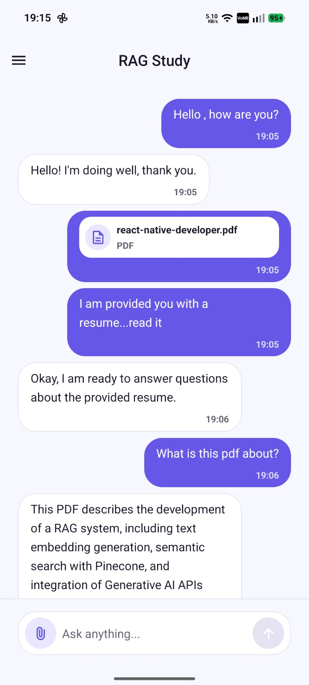

<div align="center">
  
  <h1>RAG Study</h1>
  <p>
    <strong>A mobile-first AI study workspace for PDF-grounded learning, chat, and conversation history.</strong>
  </p>
  <p>
    
    
    
    
  </p>
  <p>
    <a href="#what-it-does">Features</a>
    |
    <a href="#product-flow">Flow</a>
    |
    <a href="#tech-stack">Tech Stack</a>
    |
    <a href="#backend-contract">Backend</a>
    |
    <a href="#getting-started">Run Locally</a>
  </p>
</div>

---

RAG Study is a mobile-first Expo app that turns study material into a guided chat workspace. Students sign in with Google, upload PDF notes or documents, ask questions, and keep conversations organized so every study session can pick up where the last one ended.

Built with Expo SDK 56, Expo Router, Firebase Auth, TanStack Query, Zustand, and a backend API for authenticated chat, conversation history, and document upload.

## Screenshots

<p align="center">
  
  
</p>

## What It Does

| Area | Functionality |
| --- | --- |
| Authentication | Google One Tap sign-in backed by Firebase Auth. |
| Protected routing | Signed-out users see the welcome flow; signed-in users enter the study workspace. |
| Study chat | Users can create conversations, send questions, and receive assistant answers. |
| PDF context | Users can attach one PDF document to ground questions in their own material. |
| Conversation history | The drawer lists previous conversations and lets users reopen them. |
| Session state | Draft message, selected document, active conversation, and local bubbles are managed cleanly with Zustand. |
| Server state | Conversations and messages are cached, refreshed, and invalidated with TanStack Query. |
| Native feel | Uses Expo symbols, safe areas, keyboard-aware layout, splash screen, adaptive icons, and polished mobile styling. |

## Product Flow

1. The app starts at `src/app/index.tsx`.
2. `AuthSessionProvider` listens to Firebase auth state.
3. Expo Router redirects users:
   - signed out: `/welcome`
   - signed in: `/home`
4. The welcome screen presents the product story and Google sign-in.
5. After sign-in, the app sends the Firebase ID token to the backend social login endpoint.
6. The main drawer loads conversation history and user profile data.
7. The home screen lets users:
   - upload a PDF
   - type a study question
   - create or continue a conversation
   - send messages to the backend
   - view assistant replies and previous messages

## Tech Stack

| Layer | Tools |
| --- | --- |
| App runtime | Expo `~56.0.12`, React Native `0.85.3`, React `19.2.3` |
| Navigation | Expo Router `~56.2.11` with protected stack routes and drawer layout |
| Authentication | `@react-native-firebase/auth`, `@react-native-firebase/app`, `react-native-nitro-google-signin` |
| API | Axios for JSON requests, `expo/fetch` plus `expo-file-system` `File` for multipart PDF uploads |
| Async state | TanStack Query v5 |
| Local state | Zustand |
| UI | React Native styles, Expo Symbols, Expo Image, Safe Area Context |
| Tooling | TypeScript 6, ESLint 9, Expo lint config |

## Project Structure

```text
src/
  api/
    client.ts            # Axios clients, auth header injection, API error normalization
    endpoints.ts         # Backend route constants
  app/
    _layout.tsx          # Root providers, protected navigation, status bar
    index.tsx            # Auth-aware redirect
    (auth)/              # Signed-out route group
    (main)/              # Signed-in route group
  components/
    AppDrawerContent.tsx # Profile header, chat history, new chat, sign out
  constants/
    routes.ts            # App route constants
    strings.ts           # Product copy, accessibility labels, symbol names
    theme.ts             # Colors, spacing, radii, typography, layout tokens
  hooks/
    useKeyboard.ts       # Keyboard visibility and height tracking
  providers/
    auth-session-provider.tsx
  screens/
    Welcome.screen.tsx   # Product welcome and Google sign-in
    Home.screen.tsx      # Chat, PDF picker, message composer
  services/
    chat.ts              # Conversation, message, and document upload API functions
    chat-queries.ts      # TanStack Query hooks for chat workflows
    google-auth.ts       # Google One Tap + Firebase credential flow
    user.ts              # Current user API service
    user-queries.ts      # Current user query hook
  stores/
    chat-store.ts        # Active chat draft and selected conversation state
```

## Backend Contract

The app expects an authenticated backend at `EXPO_PUBLIC_BASE_URL`.

| Method | Endpoint | Purpose |
| --- | --- | --- |
| `POST` | `auth/social-login` | Registers or syncs the Firebase-authenticated user. |
| `GET` | `auth/me` | Loads the signed-in user's profile. |
| `POST` | `chat/conversation` | Creates a new conversation. |
| `GET` | `chat/conversations` | Lists conversation history. |
| `GET` | `chat/conversation/:id/messages` | Loads messages for a conversation. |
| `POST` | `chat/message` | Sends a text question to the assistant. |
| `POST` | `documents/upload` | Uploads a PDF as multipart form data under the `pdf` field. |

Authenticated requests include a Firebase ID token:

```http
Authorization: Bearer <firebase-id-token>
```

## Environment Setup

Create a local environment file with your backend URL:

```bash
EXPO_PUBLIC_BASE_URL=https://your-api.example.com
```

Firebase and Google sign-in also require platform configuration:

| Platform | Required setup |
| --- | --- |
| Android | Add `google-services.json` at the project root. The app is configured to read `./google-services.json`. |
| Firebase | Enable Google as a sign-in provider in Firebase Auth. |
| Google Sign-In | Configure the OAuth clients and SHA fingerprints needed by `react-native-nitro-google-signin`. |

The app currently uses `webClientId: "autoDetect"` in `src/constants/strings.ts`.

## Getting Started

Install dependencies:

```bash
npm install
```

Start the Expo dev server:

```bash
npm start
```

Run on Android:

```bash
npm run android
```

Run on iOS:

```bash
npm run ios
```

Run on web:

```bash
npm run web
```

Lint the project:

```bash
npm run lint
```

## Important Notes

- This project targets Expo SDK 56. The matching Expo versioned docs are at https://docs.expo.dev/versions/v56.0.0/.
- Native auth dependencies mean Android and iOS development builds are the primary runtime targets.
- PDF upload accepts `application/pdf` only.
- The Android config allows cleartext traffic, which is useful for local backend development. Review this before production release.
- `expo-router` typed routes and React Compiler experiments are enabled in `app.json`.

## App Configuration

| Setting | Value |
| --- | --- |
| Expo name | `RAG Study` |
| Scheme | `aistudybuddy` |
| Orientation | Portrait |
| Android package | `com.anonymous.aistudybuddy` |
| Web output | Static |
| Splash color | `#6657E8` |

## Why This Project Is Nice to Work On

The codebase keeps product copy, theme tokens, routes, API endpoints, API services, server state, and local UI state separated. That makes it easy to evolve the app one layer at a time:

- update text in `src/constants/strings.ts`
- tune visual style in `src/constants/theme.ts`
- add backend routes in `src/api/endpoints.ts`
- add server workflows in `src/services`
- extend screens without mixing auth, networking, and state logic together

## License

See [LICENSE](LICENSE).
